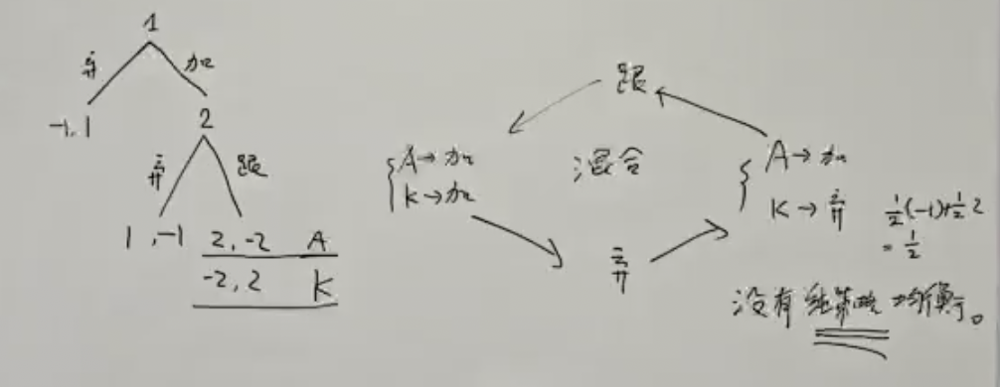
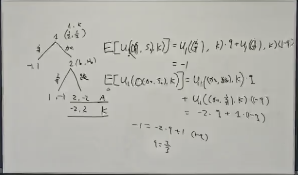
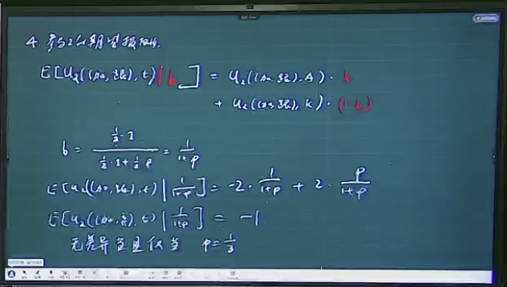

# 博弈论基础回顾

## 完全信息静态博弈

### 定义

完全信息竞赛的三要素：N（参与人），A（选择集），U（效用集）

- $G=\{A_1,A_2,\cdots,A_n,u_1,u_2,\cdots,u_n\}$，表示一个博弈；
- $n$ ：博弈方个数；
- $A_i$ ：各博弈方的策略空间；
- $u_i: A_1 \times \cdots \times A_n\to R$  ：第 $i$ 个人的收益函数。

### 占优策略

A strategy *A* **dominates** another strategy *B* if *A* will always produces a better result than *B*, regardless of how any other player plays no matter how that player's opponent or opponents play.

|                    | 乙沉默（合作） | 乙认罪（背叛） |
| :----------------: | :------------: | :------------: |
| **甲沉默（合作）** |     $-1, -1$     |     $-10, 0$     |
| **甲认罪（背叛）** |     $-10, 0$     |     $-5, -5$     |

### 完全信息博弈的纳什均衡

称行动组合 $(a_1,\ldots,a_n) \in (A_1,\ldots,A_n)$ 为纳什均衡，当且仅当: 

$$\forall i,b_i\in A_i, u_i(a_i,a_{-i})\geq u_i(b_i,a_{-i})$$

### 纳什均衡的计算

- 最优反应函数（Best response function）: $B_i(a_{-i})=argmax_{a_i \in A_i} U_i(a_i,a_{-i})$，即知道他人决策情况下，自己的最优决策集合。
- $A$ 是纳什均衡当且仅当：$\forall a_i \in A, a_i \in B_i(a_{-i})$.

## 不完全信息静态博弈

### 定义

- $G=\{A_1,A_2,\cdots,A_n,u_1,u_2,\cdots,u_n, \Theta_1,\Theta_2,\cdots,\Theta_n\}$，表示一个博弈；
- $n$ ：博弈方个数；
- $A_i$ ：各博弈方的策略空间；
- $\theta_i \in \Theta_i$：$\theta_i$ 表示第 $i$ 个人的类型，$\Theta_i$ 表示类型全集，不确定性体现在当 $\theta_i$ 发生时，只有第 $i$ 个人知道 $\theta_i$，其他人只知道一个概率分布 $f$；
- $u_i:A_1 \times \cdots \times A_n\times \Theta_1 \times \cdots \times \Theta_n \to R$  ：第 $i$ 个人的收益函数。

### 纳什均衡

- 策略 $s_i: \Theta_{i}\to A_i$，即在知道自己的类型 $\theta_i$ 的情况下，采取一个行动 $a_i$.
- 定义贝叶斯-纳什均衡，当且仅当 $\forall i,\forall a_i,\theta_i$，有：

$$
E_{\theta_{-i}}\{u_i[s_i(\theta_i),s_{-i}(\theta_{-i}),\theta_i,\theta_{-i}]\}\geq E_{\theta_{-i}}\{u_i[a_i,s_{-i}(\theta_{-i}),\theta_i,\theta_{-i}]\}
$$

- 这里的 $E_{\theta_{-i}}$ 表示的是枚举除了 $i$ 以外的类型，计算 $u_i$ 的期望.

## 完全信息动态博弈

### 定义

- **参与人集合** $I = \{1, \dots, n\}$
- **博弈树** $T$，终端历史集合 $N$
- **参与人函数** $P: T \setminus N \to I$
- **参与人的报酬函数** $u: N \to \mathbb{R}$

### 纳什均衡

- **可行行动：**在非终端历史 $h$ 处的可行行动记为一个集合：$A(h) = \{a \mid (h_k, a)_{k+1} \in T\}$​
- **策略：**参与人 $i$ 的一个策略 $s_i$ 应该在所有满足 $p(h) = i$ 的历史 $h$ 指定一个在 $A(h)$ 中的行动：$s_i : \{h \mid p(h) = i\} \to \cup A(h) \quad \text{且} \quad s_i(h) \in A(h)$
- **纳什均衡：**我这个策略改变随意任何状态下的决策，都不会更优：$u_i(O(s_i,s_{-i})) \geq u_i(O(s_i',s_{-i}))$；其中 $O$ 是从一组策略到终端历史的函数

**子博弈的精炼纳什均衡**：在任何子博弈下，都是纳什均衡。

## 不完全信息动态博弈

- 相当于在动态博弈的基础下加上了一个概率分布，你不知道对手类型，然后你要确定一个对于我自己不同类型的不同决策树
- 策略 $s_i(h,\theta_i)$；报酬函数：$u_i: N \times \Theta \to \mathbb{R}$
- 信念系统：$b_i(h)$——刻画 i 在 h 这个状态中相信的这个世界的状态，即他猜其他人的类型是什么样的 / 什么样的概率分布
- 均衡：在这个点的我的信念系统下，我无论如何改变策略，期望报酬都不会变得更优（子博弈精练：每个点都是均衡，也叫完美贝叶斯均衡）

## 混合策略纳什均衡

- 第一个人可以看到底牌是 K/A，第二个人看不到，第一个人选择是否加注，第二个人选择是否跟注。
- 在这种博弈下，没有**纯策略均衡**，是一种**混合策略均衡**，即每个人在每个决策点，不是单一决策，而是概率决策。
- 何时均衡？在这个概率下，任何一方改变决策，都不会使得期望收益更多。

记先手摸到 K 以后选择加的概率是 p，后手选择跟的概率为 q：

（b：先手选择加的情况下，牌为 A 的概率）

根据这个概率计算出来的完美贝叶斯均衡，这个博弈是不公平的。

