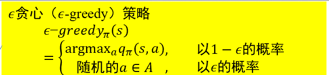
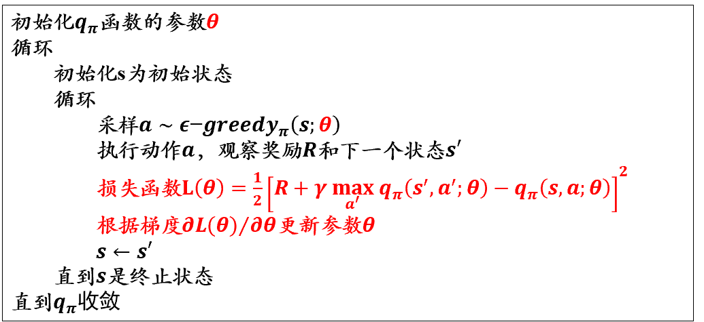
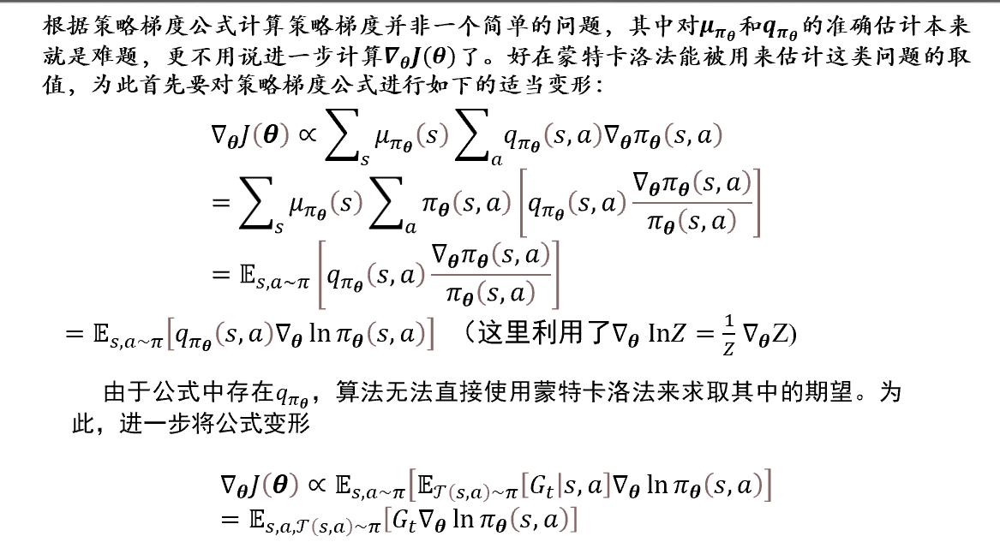

# 强化学习

## 强化学习问题定义

强化学习（Reinforcement Learning, RL）是一种以决策为核心的机器学习方法，模型通过与环境交互，从反馈信号中学习最优策略，以实现长期累积收益的最大化。

### 核心概念

强化学习的核心概念包括以下三个部分：

1. **智能体（Agent）**  

   智能体是执行动作、与环境交互的主体。它通过观察环境状态，选择动作并从环境中获取奖励，逐步学习最佳的行为策略。

2. **环境（Environment）**  

   环境是智能体行为发生的外部条件。智能体的动作会影响环境的状态变化，同时环境会根据智能体的行为提供奖励信号。

3. **策略（Policy, $\pi$）**  

   策略是智能体决策的规则，表示为在某一状态 $s$ 下采取动作 $a$​ 的概率分布：  
   $$
   \pi(a|s) = P(a|s)
   $$
   策略分为以下两种：

   - **确定性策略**：在每个状态下选择一个固定的动作。
   - **随机性策略**：在每个状态下根据概率分布选择动作。

4. **累积奖励（Cumulative Reward）**  

   强化学习的目标是最大化累积奖励，从时间步 $t$​ 开始的累积奖励定义为：
   $$
   G_t = R_{t+1} + \gamma R_{t+2} + \gamma^2 R_{t+3} + \dots = \sum_{k=0}^\infty \gamma^k R_{t+k+1}
   $$
   其中，$\gamma$ 是折扣因子，$0 \leq \gamma \leq 1$，表示未来奖励的衰减程度。

5. **值函数（Value Function）**  

   值函数用于评估某一状态（或状态-动作对）的优劣，其定义为从某一状态开始的累积奖励期望值：  

   - 状态值函数 $V_\pi(s)$：  
     $$
     V_\pi(s) = \mathbb{E}[G_t | s_t = s, \pi]
     $$
   - 状态-动作值函数 $Q_\pi(s, a)$：  
     $$
     Q_\pi(s, a) = \mathbb{E}[G_t | s_t = s, a_t = a, \pi]
     $$

6. **探索与利用的权衡（Exploration vs Exploitation）**  

   - **探索（Exploration）**：尝试未知的状态和动作，以发现潜在的高奖励策略。  
   - **利用（Exploitation）**：基于已有经验选择最优动作，追求当前的最高奖励。  

   强化学习需要在探索和利用之间找到平衡。

### 马尔可夫决策过程（MDP）

马尔可夫决策过程由以下 5 个元素组成：

1. **状态（State, $S$）**  

    系统当前所处的描述，表示为 $s \in S$​。  

    - $S$ 是状态空间，包括所有可能的状态。  
    - 例如，在棋盘游戏中，$s$ 可以表示当前棋盘的布局。

2. **动作（Action, $A$）**  

    智能体在当前状态下可以选择的行为，表示为 $a \in A(s)$​。  

    - $A(s)$ 是状态 $s$ 下可执行的动作集合。  
    - 例如，在机器人控制中，$a$ 可以表示机器人执行的某个运动指令。

3. **状态转移概率（Transition Probability, $P$）**  

    状态从 $s$ 转移到 $s'$ 的概率，定义为 $P(s'|s, a)$，即在状态 $s$ 下执行动作 $a$ 后转移到状态 $s'$​ 的概率。  

    - 满足马尔可夫性：未来状态 $s'$ 仅依赖于当前状态 $s$ 和动作 $a$，而与过去的状态序列无关。

4. **奖励（Reward, $R$）**  

    智能体在某一状态或执行某一动作后获得的即时反馈信号，表示为 $R(s, a)$ 或 $R(s, a, s')$​。  

    - 奖励函数衡量某一状态或行为的优劣，是强化学习的学习目标。

5. **折扣因子（Discount Factor, $\gamma$）**  

    表示未来奖励的衰减程度，范围为 $0 \leq \gamma \leq 1$。  

    - 当 $\gamma$ 接近 1 时，模型更重视长期回报；当 $\gamma$ 接近 0 时，模型更关注短期奖励。

### 强化学习的目标

强化学习的目标是找到一个最优策略 $\pi^*$，使得在每一个时间步 $t$，智能体的累积奖励期望最大化。策略 $\pi$ 是一个映射，定义为：
$$
\pi(a|s) = P(a|s)
$$
即在状态 $s$ 下选择动作 $a$ 的概率。

累积奖励的定义为：
$$
G_t = R_{t+1} + \gamma R_{t+2} + \gamma^2 R_{t+3} + \dots = \sum_{k=0}^\infty \gamma^k R_{t+k+1}
$$
其中：  

- $G_t$ 是从时间步 $t$ 开始的累积奖励。  
- $\gamma$ 是折扣因子，用于平衡短期和长期奖励。

强化学习的目标可以表示为：
$$
\pi^* = \arg\max_{\pi} \mathbb{E}[G_t|\pi]
$$

### 强化学习的核心问题

1. **探索与利用的权衡（Exploration vs Exploitation Tradeoff）**  

    - **探索**：尝试未知的状态和动作，以发现潜在的更高奖励。  
    - **利用**：基于已有经验选择最优动作，以获得更高的当前奖励。  
    - 强化学习需要在探索和利用之间找到平衡。

2. **策略优化（Policy Optimization）**  

    - 如何更新策略 $\pi$，使得累积奖励最大化，是强化学习的核心问题之一。  
    - 策略优化的两种方法：  

        - **值函数方法**：通过学习值函数（如 Q 值）间接优化策略。  
        - **策略梯度方法**：直接优化策略 $\pi$。

3. **长期与短期回报的平衡**  
    - 强化学习需要考虑短期奖励和长期奖励之间的权衡。  
    - 折扣因子 $\gamma$​ 决定了智能体对未来奖励的重视程度。

## 基于价值的强化学习

基于价值的强化学习（Value-based Reinforcement Learning）是一类通过学习状态值函数或状态-动作值函数来确定最优策略的强化学习方法。其核心思想是评估每个状态或状态-动作对的长期累积奖励期望值，并据此选择最优动作。

### 核心概念

1. **值函数（Value Function）**  

   值函数用于评估状态或状态-动作对的优劣。基于价值的强化学习的目标是通过迭代更新值函数来找到最优策略。常见的值函数包括：

   - **状态值函数 $V(s)$**：描述从状态 $s$ 开始、遵循某策略 $\pi$ 所能获得的期望累积奖励：
     $$
     V_\pi(s) = \mathbb{E}[G_t | s_t = s, \pi]
     $$

   - **状态-动作值函数 $Q(s, a)$**：描述从状态 $s$ 执行动作 $a$ 后、遵循某策略 $\pi$ 所能获得的期望累积奖励：
     $$
     Q_\pi(s, a) = \mathbb{E}[G_t | s_t = s, a_t = a, \pi]
     $$

   **最优值函数**：最优策略 $\pi^*$ 对应的值函数：

   - 最优状态值函数：

     $$
     V^*(s) = \max_\pi V_\pi(s)
     $$

   - 最优状态-动作值函数：

     $$
     Q^*(s, a) = \max_\pi Q_\pi(s, a)
     $$

2. **贝尔曼方程（Bellman Equation）**  

贝尔曼方程描述了值函数的递归关系，为基于价值的强化学习提供了更新的理论基础：

对于状态值函数：

$$
V_\pi(s) = \mathbb{E}_{a \sim \pi, s' \sim P} \left[R(s, a) + \gamma V_\pi(s') \right]
$$

对于状态-动作值函数：

$$
Q_\pi(s, a) = \mathbb{E}_{s' \sim P} \left[R(s, a) + \gamma \mathbb{E}_{a' \sim \pi} Q_\pi(s', a') \right]
$$

最优状态值函数的贝尔曼方程：

$$
V^*(s) = \max_a \mathbb{E}_{s' \sim P} \left[R(s, a) + \gamma V^*(s') \right]
$$

最优状态-动作值函数的贝尔曼方程：

$$
  Q^*(s, a) = \mathbb{E}_{s' \sim P} [R(s, a) + \gamma \max_{a'} Q^*(s', a') ]
$$

### 典型方法

#### 动态规划（Dynamic Programming, DP）

动态规划是基于已知的环境模型，通过递归计算值函数来找到最优策略的方法。

1. **策略评估（Policy Evaluation）**  

      策略评估用于计算一个固定策略 $\pi$​ 的值函数，通过反复迭代直到收敛：
      $$
      V_\pi(s) \gets \sum_{a \in A} \pi(a|s) \sum_{s' \in S} P(s'|s, a) \left[R(s, a, s') + \gamma V_\pi(s')\right]
      $$
      $\sum_{a \in A} \pi(a|s) \sum_{s' \in S}P(s'|s, a)$ 其实都是概率分布，动态规划的限制就在于我们要提前知道整个的 $P$ 概率分布.

2. **策略改进（Policy Improvement）**  

      策略改进通过选择能最大化值函数的动作来更新策略：

      $$
      \pi'(a|s) = \begin{aligned}
            \begin{cases} 
            1 & \text{if } a = \arg\max_{a \in A} Q_\pi(s, a) \\ 
            0 & \text{otherwise}
            \end{cases}
         \end{aligned}
      $$

3. **策略迭代（Policy Iteration）**  

      策略迭代是交替进行策略评估和策略改进的过程，最终收敛到最优策略 $\pi^*$​。

4. **值迭代（Value Iteration）**  

      值迭代通过直接更新值函数来找到最优策略：
      $$
      V(s) \gets \max_{a \in A} \sum_{s' \in S} P(s'|s, a) \left[R(s, a, s') + \gamma V(s')\right]
      $$

#### 蒙特卡洛方法（Monte Carlo Methods）

蒙特卡洛方法通过采样与环境的交互序列，直接估计值函数，无需已知的环境模型。适用于长期奖励计算。

1. **核心思想**  

      蒙特卡洛方法基于多次模拟的累积奖励平均值来估计值函数：
      $$
      V(s) = \mathbb{E}[G_t | s_t = s]
      $$

2. **回报计算**  

      在一个完整的序列（Episode）中，回报 $G_t$ 是从时间步 $t$​ 开始的累积奖励：
      $$
      G_t = R_{t+1} + \gamma R_{t+2} + \dots + \gamma^{T-t-1} R_T
      $$

3. **优点与局限**  

   - **优点**：无需环境模型，能够处理复杂的非周期性任务。  
   - **局限**：计算延迟（需等待整个序列结束），对任务的样本效率要求较高。

#### 时间差分学习（Temporal-Difference, TD）

时间差分方法结合了动态规划和蒙特卡洛方法的优势，能够在未到达最终状态之前就更新值函数。

1. **核心思想**  

   时间差分方法通过对当前的值函数进行局部更新，而不需要等待整个序列结束：
   $$
   V(s) \gets V(s) + \alpha \left[R + \gamma V(s') - V(s)\right]
   $$

2. **典型算法**  

   - **TD(0)**：直接更新当前状态的值函数。  
   - **SARSA**：基于当前策略更新状态-动作值函数（on-policy 方法）：  
     $$
     Q(s, a) \gets Q(s, a) + \alpha \left[R + \gamma Q(s', a') - Q(s, a)\right]
     $$
   - **Q-Learning**：基于最优策略更新状态-动作值函数（off-policy 方法）：  
     $$
     Q(s, a) \gets Q(s, a) + \alpha \left[R + \gamma \max_{a'} Q(s', a') - Q(s, a)\right]
     $$

3. 引入 $\epsilon$ greedy 探索机制：

   

   防止每个点都经验主义，导致走不到目标点。

   （当然，也可以引入 Deep-Learning 来拟合 q 函数，在 $q(s,\alpha)$ 的基础上再引入 $\theta$：）

   

4. **特点与局限**  

   - **特点**：高效、无需等待完整序列，适合实时任务。  
   - **局限**：对学习率 $\alpha$ 的选择较敏感，可能收敛较慢。

## 基于策略的强化学习

基于策略的强化学习（Policy-based Reinforcement Learning）是一类通过直接优化策略 $\pi(a|s)$ 来找到最优策略的强化学习方法。与基于价值的方法不同，基于策略的方法不需要显式地估计值函数，而是直接建模和优化策略函数。基于策略的强化学习能够处理高维或连续的动作空间，适用于策略需要随机性或复杂性的场景。

### 核心思想

1. **策略函数**  

   策略 $\pi_\theta(a|s)$ 是一个参数化的函数，表示在状态 $s$ 下选择动作 $a$ 的概率，由参数 $\theta$​ 控制。  

   策略可以是：  

   - **确定性策略**：$\pi_\theta(s) = a$，在状态 $s$ 下输出确定的动作 $a$。  
   - **随机性策略**：$\pi_\theta(a|s)$，在状态 $s$ 下按照分布生成动作 $a$。

2. **目标函数**  

   基于策略的方法的目标是最大化累积奖励的期望：
   $$
   J(\theta) = \mathbb{E}_{\tau \sim \pi_\theta} \left[\sum_{t=0}^\infty \gamma^t R_t \right]
   $$
   其中，$\tau$ 表示一个状态-动作序列（trajectory）。

3. **策略优化**  

   通过梯度上升法优化目标函数 $J(\theta)$，更新策略参数 $\theta$​：
   $$
   \theta \gets \theta + \alpha \nabla_\theta J(\theta)
   $$
   其中，$\alpha$ 是学习率。

### 基于蒙特卡洛采样的策略梯度法

基于蒙特卡洛采样的策略梯度法使用完整的状态-动作序列（trajectory）对策略梯度进行估计，通过累积奖励指导策略的更新。

#### 策略梯度定理

那个对于策略求导，感觉就是参数改变，策略会产生偏移的量。

策略梯度的数学公式为：

   $$
   \nabla_\theta J(\theta) = \mathbb{E}_{\tau \sim \pi_\theta} \left[\sum_{t=0}^\infty \nabla_\theta \log \pi_\theta(a_t|s_t) G_t \right]
   $$

其中：  

- $\log \pi_\theta(a_t|s_t)$ 是策略的对数概率。  
- $G_t = \sum_{k=0}^\infty \gamma^k R_{t+k}$ 是从时间步 $t$ 开始的累积奖励。

#### 蒙特卡洛梯度估计

1. **采样序列**：从当前策略 $\pi_\theta$ 中采样多条完整的状态-动作序列 $\tau$。  
2. **计算累积奖励**：对每条序列，计算从每个时间步 $t$ 开始的累积奖励 $G_t$。  
3. **更新参数**：基于采样序列计算梯度，更新策略参数：
   $$
   \nabla_\theta J(\theta) \approx \frac{1}{N} \sum_{i=1}^N \sum_{t=0}^\infty \nabla_\theta \log \pi_\theta(a_t|s_t) G_t
   $$
   其中，$N$ 是采样序列的数量。

### 基于时序差分的策略梯度法

基于时序差分（Temporal-Difference, TD）的策略梯度法结合了蒙特卡洛采样和时间差分的思想，通过局部更新策略，避免等待完整序列结束，具有更高的计算效率。

#### 策略梯度定理的改进

在基于时序差分的方法中，累积奖励 $G_t$ 被替换为状态值函数 $V_\pi(s_t)$ 或优势函数 $A_\pi(s_t, a_t)$，从而提高梯度估计的稳定性。

1. **状态值函数 $V_\pi(s_t)$**：描述状态 $s_t$ 的价值。  
2. **优势函数 $A_\pi(s_t, a_t)$**：表示动作 $a_t$ 相对于平均策略的优势，定义为：
   $$
   A_\pi(s_t, a_t) = Q_\pi(s_t, a_t) - V_\pi(s_t)
   $$

#### 时间差分的策略梯度更新

时间差分的策略梯度公式为：
$$
\nabla_\theta J(\theta) = \mathbb{E}_{\tau \sim \pi_\theta} \left[\nabla_\theta \log \pi_\theta(a_t|s_t) \delta_t \right]
$$

其中：  

- $\delta_t$ 是 TD 误差，定义为：
  $$
  \delta_t = R_t + \gamma V_\pi(s_{t+1}) - V_\pi(s_t)
  $$

#### 优化方法

1. **Actor-Critic 方法**  

   - **Actor（策略网络）**：参数化策略 $\pi_\theta(a|s)$，更新策略参数 $\theta$。  

   - **Critic（值函数网络）**：参数化值函数 $V_w(s)$，更新值函数参数 $w$​。  

     Actor-Critic 的更新规则为（一是改变策略，而是改变估值）：
   $$
   \theta \gets \theta + \alpha \nabla_\theta \log \pi_\theta(a_t|s_t) \delta_t
   $$
   $$
   w \gets w + \beta \delta_t \nabla_w V_w(s_t)
   $$

2. **优势演员评论法（Advantage Actor-Critic, A2C）**  

   - 使用优势函数 $A_\pi(s_t, a_t)$ 替代 TD 误差 $\delta_t$，提高收敛性。
