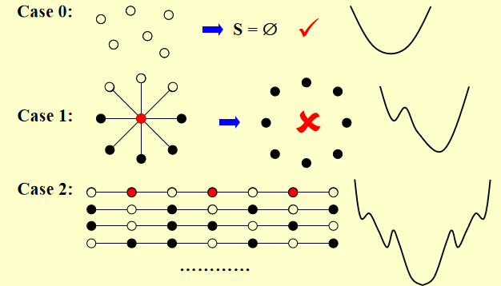

# 局部搜索

```pseudocode
SolutionType Gradient_descent()
{   Start from a feasible solution S  FS ;
    MinCost = cost(S);
    while (1) {
        S’ = Search( N(S) ); /* find the best S’ in N(S) */
        CurrentCost = cost(S’);
        if ( CurrentCost < MinCost ) {
            MinCost = CurrentCost;    S = S’;
        }
        else  break;
    }
    return S;
}
```

局部搜索的一些常见变种包括：

- **爬山算法（Hill Climbing）**：一种简单的局部搜索方法，通过选择邻域中最好的解逐步优化，直到没有更好的解为止。
- **模拟退火（Simulated Annealing）**：在爬山算法的基础上引入了随机性，允许接受较差的解，从而避免陷入局部最优解。
- **禁忌搜索（Tabu Search）**：通过维护一个禁忌表来记录已经访问过的解，防止算法反复访问已探索过的区域，从而提高搜索效率。

## Vertex Cover 问题

> 给定一个无向图 $G = (V, E)$，以及一个正整数 $K$，是否存在 $V$ 的一个子集 $C$，使得 $C$ 中点的个数不超过 $K$，且对于每一条边 $(u, v) \in E$，至少有一个端点在 $C$ 中；在点集覆盖问题的基础上，找到最小的点集覆盖。



如果我们可以容忍暂时的代价升高，有可能会遇到代价降低更好的情况

```pseudocode
SolutionType Metropolis()
{   Define constants k and T;
    Start from a feasible solution S in FS ;
    MinCost = cost(S);
    while (1) {
        S’ = Randomly chosen from N(S); //Choosing neighbor
        CurrentCost = cost(S’);
        if ( CurrentCost < MinCost ) {
            MinCost = CurrentCost;    S = S’;
        }
        else {
            With a probability, let S = S’;
            else  break;
        }
    }
    return S;
}
```

## 模拟退火

## Hopfield 神经网络

> 1. Hopfield 神经网络可以抽象为一个无向图 $G = (V, E)$，其中 $V$ 是神经元的集合，$E$ 是神经元之间的连接关系，并且每条边 $e$ 都有一个权重 $w_e$，这可能是正数或负数：
>
> 2. Hopfield 神经网络的一个状态 (configuration) 是指网络中每个神经元（即图的顶点）的状态的一个取值，倾向值能为 $1$ 或 $-1$。我们记顶点 $u$ 的状态为 $s_u$。
>
> 3. 如果对于边 $e = ((u, v))$，我们定义 $c_e = w_e s_u s_v$，我们希望 $c_e < 0$。
>
> 4. 我们将上述条件的边称为“好的” (good)，而称为“坏的” (bad)。
>
> 5. 如果我们一点是“满意的” (satisfied)，当且仅当它所连接的所有点中，好的边的权重绝对值大于等于坏边的，即
>
>    $$
>    \sum_{(u,v) \in E} w_e(u,v) s_v s_u < 0,
>    $$
>
>    反之，如果不满足这一条件，我们称其为“不满意的” (unsatisfied)。
>
> 6. 最后，我们称一个构型是“稳定的” (stable)，当且仅当所有的点都是满意的。

- 状态翻转算法：

```c
ConfigType State_flipping()
{
    Start from an arbitrary configuration S;
    while ( ! IsStable(S) ) {
        u = GetUnsatisfied(S);
        su = - su;
    }
    return S;
}
```
