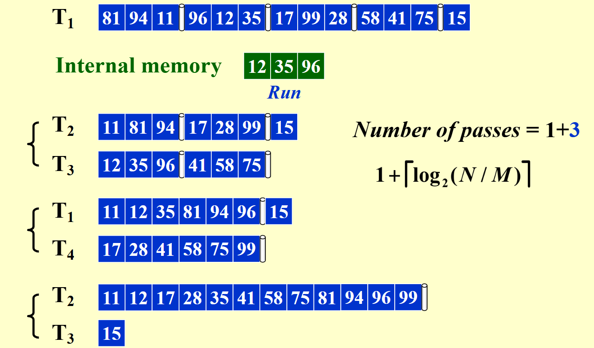

# 外部排序

如果数据输入在磁带上，由于磁带只能被顺序访问，所以适合用于外部排序的排序算法是归并排序。

## 简单做法

假设一开始数据存储在磁带 $T_1$ 上，外部内存容量是 3，则依次读取 3 个数据为一组，交替放在磁带 $T_2$ 和 $T_3$ 上，然后按对应归并 $T_2$ 和 $T_3$ 上的数据，结果交替放在 $T_1$ 和 $T_4$ 上，然后重复这个过程，直到所有数据都排序完成。

- run: 每组排好序的数据称为一个run
- pass: 将所有数据读过一遍的称为一个pass

## K-way Merge

k 路合并有一个实现上需要注意的点，因为我们是 k 个顺串要合并，因此我们需要不断的在 k 个元素中选取最小值放到输出的磁带上，这个操作可以使用优先队列来实现。

## 多相合并

为了优化多路合并对于磁带数的成本，我们考虑多相合并，这种方法对于多路合并的磁带成本可以从 $2k$ 减少到 $k + 1$。

这种方法就是每次均分，然后合并，然后再均分合并……但是需要较多的复制合并次数，不优秀。

我们考虑斐波那契数列，发现这样是最优秀的。

如果 run 个数不足，就用哑串来补足斐波那契。

将上述算法应用到 k-way merge，则需要 k 阶斐波那契数。

定义为

$$
F^{(k)}(n) = F^{(k)}(n-1) + F^{(k)}(n-2) + \cdots + F^{(k)}(n-k)
$$

且

$$
F^{(k)}(0) = F^{(k)}(1) = \cdots = F^{(k)}(k-2) = 0, \quad F^{(k)}(k-1) = 1
$$
经过第一个 pass 初始化之后，$k+1$ 个 tape 的结构如下：

$$
\begin{aligned}
\text{tape1}: & \ F^{(k)}(n-1) + F^{(k)}(n-2) + \cdots + F^{(k)}(n-k+1) + F^{(k)}(n-k) \\
\text{tape2}: & \ F^{(k)}(n-1) + F^{(k)}(n-2) + \cdots + F^{(k)}(n-k+1) \\
\text{tape3}: & \ F^{(k)}(n-1) + F^{(k)}(n-2) + \cdots \\
\vdots & \ \\
\text{tapek}: & \ F^{(k)}(n-1) \\
\text{tape(k+1)}: & \ 0
\end{aligned}
$$

然后合并，结果放在 $tape(k+1)$ 上，结果如下，发现符合之前的结构，可以继续向下递归。

$$
\begin{aligned}
\text{tape1}: & \ F^{(k)}(n-2) + F^{(k)}(n-3) + \cdots + F^{(k)}(n-k) \\
\text{tape2}: & \ F^{(k)}(n-2) + F^{(k)}(n-3) + \cdots + F^{(k)}(n-k+1) \\
\text{tape3}: & \ F^{(k)}(n-2) + F^{(k)}(n-3) + \cdots \\
\vdots & \ \\
\text{tapek}: & \ 0 \\
\text{tape(k+1)}: & \ F^{(k)}(n-1) = F^{(k)}(n-2) + F^{(k)}(n-3) + \cdots + F^{(k)}(n-k-1)
\end{aligned}
$$
注意，斐波那契的方法会使 pass 变多，我们这里要做的是尽可能减少读写磁头的扫描次数和磁带个数。

**如果 runs 的长度已经固定，最小 merge 时间？——哈夫曼编码**

## 并行优化

> 本质上就是 K-way 的优化，K-way 里面的 m 和这里的内存分区不是一回事情；前者是在最开始分块排序用的，后者则是在 runs 之间合并的时候采用的流水线分区。

在 K-way Merge 的基础上，加一个流水线。

一：空的内存分区读取磁带数据

二：另外 K 个内存分区进行合并，合并结果存到等长的一个输出分区，然后输入分区合并，会空出来一个输入分区

三：输出分区满了以后，将输出分区写入（因为一个输出分区在接收合并，另一个在写入，所以要 2 个）

有点抽象就着例子拟合吧

> **Run 1**: 1, 3, 5, 7, 8, 9, 10, 12
>
> **Run 2**: 2, 4, 6, 15, 20, 25, 30, 32
>
> Use 2-way merge with 4 input buffers and 2 output buffers for parallel operations. Which of the following three operations are NOT done in parallel?
>
> A. 1 and 2 are written onto the third tape; 3 and 4 are merged into an output buffer; 6 and 15 are read into an input buffer
>
> B. 3 and 4 are written onto the third tape; 5 and 6 are merged into an output buffer; 8 and 9 are read into an input buffer
>
> C. 5 and 6 are written onto the third tape; 7 and 8 are merged into an output buffer; 20 and 25 are read into an input buffer
>
> D. 7 and 8 are written onto the third tape; 9 and 15 are merged into an output buffer; 10 and 12 are read into an input buffer

D 选项强行想要 parallel ，因此没有管正在读入的 10, 12，直接基于现有 3 个 buffer 块 merge ，因此进行了错误的 merge(9, 15)。事实上这一步无法 parallel ，必须等待 10, 12 读完之后才能进行正确的 merge(9, 10)。

