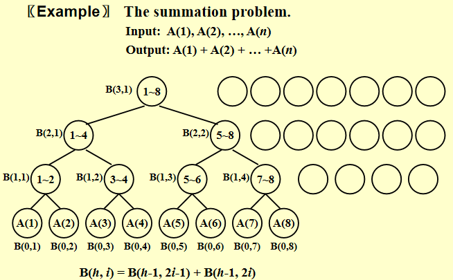
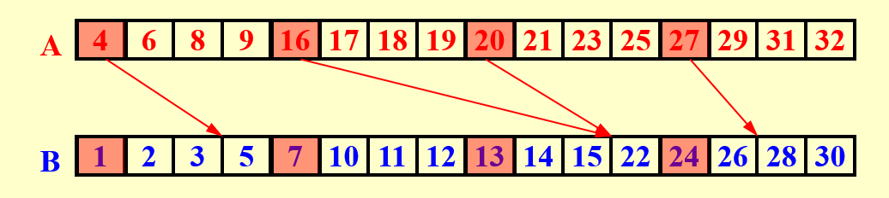
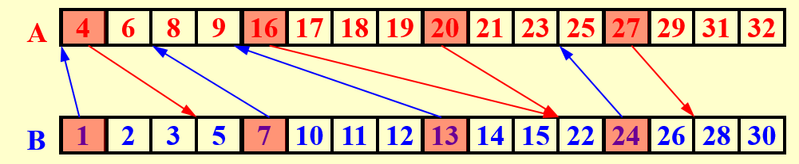

# 并行算法

加速比：$S(p)=\dfrac{T_1}{T_p}$，其中 $T_1$ 是使用一个处理器的运行时间，$T_p$ 是使用 $p$ 个处理器时的运行时间。

理想加速比：$S(p)=\dfrac{T_1}{T_p}=p$.

$W(n)$：总操作所需时间，$T(n)$：运行的瓶颈，即并行算法的最长路径

使用 $p$ 个处理器：$W(n)/p+T(n)$ 就是总的复杂度

## 前缀和问题

对于求和问题，可以转换为二叉树的求和问题，每个节点表示一个求和操作，每个节点有两个子节点，分别表示两个求和操作。

对于前缀和问题，先定义如下式子：

$$
C(h, i) = \sum_{k=0}^{\alpha} A(k)
$$

其中 $h$ 表示树的高度，$i$ 表示树的第 $i$ 个节点，$\alpha$ 表示树的最右下角节点的 $i$ 值，$A(k)$ 表示数组 $A$ 的第 $k$​ 个元素。

相当于 $B$ 是子树和，$C$ 是 0 到右子树的和。

在计算前缀和时，先从上往下计算得到每一个部分和的 $B$ 值，然后从下往上计算得到每一个部分和的 $C$ 值.

并且运用以下性质：

1. 如果 $i = 1$，那么 $C(h, i) = B(h, i)$.

2. 如果 $i$ 是偶数，这表明这个 $i$ 点是其父节点的右儿子，因此它和它的父亲根右下角的叶子是同一个，因此有 $C(h, i) = C(h + 1, i/2)$；

3. 如果 $i$ 是奇数且不是 1，这表明这个 $i$ 点是某个点的左儿子，首先它自己的值 $B(h, i)$ 不是从 1 开始加的，所以我们要选一个左边的点，把从 1 开始加到这个点对应的之前的部分补上，即 $C(h, i) = C(h + 1, (i - 1)/2) + B(h, i)$。

在这种算法下，我们可以在 $log$ 的时间内求出前缀和数组。

## 归并问题

如果直接二分并行，最后整理插入的时候需要的时间复杂度仍是 $O(n)$，没有任何优化。

**划分**: 我们将每个数组划分为 $p$ 份，使用二分查找，这样深度为 $O(\log n)$，总工作量为 $O(p \log n)$​。

二分结束以后，在每个小块之间进行归并排序，每一部分的时间复杂度为 $O(n/p)$.

取 $p=\dfrac{n}{logn}$，我们可以得到 $T(n)=O(logn),W(n)=O(n)$ 的并行算法。

## 寻找最大元素

最激进的做法：用 $n^2$ 个处理器，每次比较一对元素，较小的那个直接 out，最后用 $n$ 个处理器扫描哪个没 out 即可，$T(n)=1,W(n)=n^2$

二叉树的做法：深度 $O(logn)$，总工作量 $O(n)$​​，接下来想办法结合两种方法，在总工作量和深度之间权衡。

### 双对数划分范式(double logarithmic partitioning)

对于规模为 $n$ 的问题：

- 先把 $n$ 拆分成 $\sqrt n$ 份，每一份向下递归，总层数 $O(loglogn)$.
- 对于解决完的 $\sqrt n$ 个数，再调用激进做法，总工作量 $O(n)$.
- 所以 $T(n)=loglogn, W(n)=nloglogn$.

### 加速级联范式(accelerated cascade)

1. 将数组分为 $\dfrac{n}{\log \log n}$ 份，即每一份的大小为 $\log \log n$。可以直接利用线性查找的方式找到每一份的最大值，则每一份的深度和工作量都是 $O(\log \log n)$ 的；

2. 然后我们对上面求出的 $\dfrac{n}{\log \log n}$ 个最大值使用双对数范式的算法。

总的深度为每一份的深度加上双对数范式的深度，即

$$
T(n) = O(\log \log n) + O(\log \log (n / \log \log n)) = O(\log \log n)
$$

总工作量为每一份的工作量之和加上双对数范式的总工作量，即

$$
W(n) = \frac{n}{\log \log n} \cdot O(\log \log n) + O(n / \log \log n \cdot \log \log n) = O(n)
$$

### 随机算法

随机算法可以保证以非常高的概率在 $O(1)$ 的深度和 $O(n)$ 的工作量内找到最大值。

1. 从长度为 $n$ 的数组 $A$ 中，依照均匀分布取出 $n^{7/8}$ 个元素，得到新的数组记为 $B$。这一步需要 $n^{7/8}$ 个处理器各自负责抽一个然后放到内存中某个位置，深度为 $O(1)$，总工作量为 $O(n^{7/8})$。

2. 求出 $B$ 中的最大值，使用确定性的算法实现，通过如下三个子步骤实现：

3. 把 $B$ 分成 $n^{3/4}$ 个长度为 $n^{1/8}$ 的子数组，然后使用两两比较的暴力算法并行找到每个子数组的最大值。这一步深度为 $O(1)$，总工作量为 
   $$
   O(n^{3/4} \cdot (n^{1/8})^2) = O(n),
   $$
   因为有 $n^{3/4}$ 个子数组，每个子数组用两两比较的方法的复杂度是数组长度平方级别的；然后将这 $n^{3/4}$ 个最大值放在新数组 $C$ 中。

4. 把 $C$ 分成 $n^{1/2}$ 个长度为 $n^{1/4}$ 的子数组，然后使用两两比较的暴力算法并行找到每个子数组的最大值。这一步深度为 $O(1)$，总工作量为 
   $$
   O(n^{1/2} \cdot (n^{1/4})^2) = O(n),
   $$
   然后将这 $n^{1/2}$ 个最大值放在新数组 $D$ 中。

5. 数组 $D$ 直接使用两两比较的方法找到最大值。这一步深度为 $O(1)$，总工作量为 
   $$
   O((n^{1/2})^2) = O(n).
   $$

目前我们只得到了 $n^{7/8}$ 个元素中的最大值（记为 $M$）。如何进一步提高概率呢？答案是再来一轮，但这再来一轮是有讲究的。

这一步我们首先均匀分布取出 $n^{7/8}$ 个元素，得到数组 $B$。然后用 $n$ 个处理器，每个处理器放 $A$ 的一个元素，与前一步得到的 $M$ 进行比较。如果小于 $M$，则什么也不用做；大于 $M$ 则往数组 $B$ 的一个随机位置写入这一更大的值（因为不能一一映射所以只能随机写入）。

写完后，我们再次求出更新后的 $B$ 中的最大值。这一步的深度和工作量与第二步相同，因此是 $O(1)$ 的深度和 $O(n)$​ 的工作量。

这样循环 $O(1)$ 次，可以保证到很高的概率。