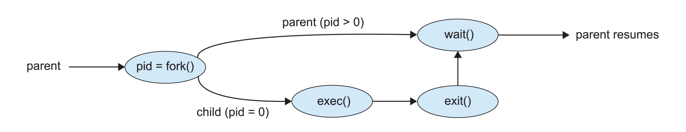

# Process

## Concepts

### 内存布局


对于 C 语言的内存布局（**User Space**），从高地址到低地址依次如下：

- 高端内存：内存位置最高的地方单独用于传递参数 `argc` 和 `argv` 到 `main()` 函数；
- 栈和堆：分别向低地址和高地址增长（存放调用函数的时候的临时数据和动态分配的内存）；
- 未初始化的全局变量（`.bss` 段）；
- 初始化的全局变量（`.data` 段）；
- 程序代码（`.text` 段）

### 运行时栈（Runtime Stack）

- 运行时栈的条目被称为激活记录/Activation Record；
- 激活记录内保存了调用函数时的函数参数、局部变量、返回地址与返回值，调用者和被调用者也需要遵循调用惯例保存寄存器的值；
- 栈完全由用户本身操控，编译器代表用户生成代码来操作栈。
- 运行时栈也会向下增长，递归调用过深就会爆掉（Runtime Stack Overflow），这时候就产生一个陷阱/Trap，操作系统内核就会终止程序。

### 用户栈和内核栈

用户栈是用户空间中的一块区域，用于保存用户进程的子程序间相互调用的参数、返回值以及局部变量等信息；

用户栈的大小一般为 8M。可以通过 ulimit -s 来手动设置。

进程由于中断而陷入到内核态，进程进入内核态之后，首先把用户态的堆栈地址保存在内核态堆栈中，然后设置堆栈寄存器地址为内核栈地址，这样就从用户栈转换成内核栈。

**设置用户栈和内核栈的原因：**内核栈的空间是有限的，所以不能把函数调用等所有的数据都存在内核态中。但是如果我们只存储堆栈的地址，那么内存态的空间就可以得到很大的节省。并且，不在内存里存储函数的数据，可以更好地防止攻击，保护系统的安全。

**内核栈的布局：**


需要注意的是，内核栈每个进程都是独有的，C 语言下内核栈的定义大致如下：

```c
union thread_union {
	struct thread_info thread_info;
	unsigned long stack[THREAD_SIZE/sizeof(long)];
};
```


### 进程控制块（PCB）

每个进程有且只有一个 PCB，PCB 会在新进程被创建的时候分配，在进程终止的时候被释放，其保存的信息大致如下：

- 进程状态/Process State：可以包含新建、就绪、运行、等待、停止等状态；
- 程序计数器/Program Counter：该进程将要执行的下条指令的地址；
- CPU 寄存器：所有和进程相关的寄存器的值，比如累加器、索引寄存器、堆栈指针和通用寄存器等等；
- CPU 调度信息：包括进程的优先级、调度队列指针、进程状态等；
- 内存管理信息：包括数据的基址和界限、页表、段表等；
- 记账信息/Accounting Information：包括 CPU 使用时间、实际使用时间、时间期限等；
- I/O 状态信息：分配给进程的 I/O 设备列表、打开文件列表等。

有关 PCB 链表的维护：


- 链表中的查找过程：不停地跳 next，每次跳完 next 以后把指针强转成 task_struct，因为强转以后内存地址不变，所以可以直接定位到下一个 task_struct
- 没有单独维护一个 list，只是对于每个 task 添加了一个 pre 和 next 变量

### 进程的状态

- 新建/New：进程正在被创建；
- 就绪/Ready：进程已经准备好运行，等待分配处理器；
- 运行/Running：进程正在被执行；
- 等待/Waiting：进程正在等待某个事件发生；
- 终止/Terminated：进程已经执行完毕。


## 进程的创建

### 基本概念

创建进程称为父进程，新进程称为子进程，这样会形成一个**进程树**。

在 Linux 系统中，0 号进程是 IDLE，1 号进程是 systemd，是所有用户进程的父进程。

当某个进程创建新进程的时候，有两种执行可能：

- 父进程继续执行（父进程和子进程并发执行）；
- 父进程等待子进程执行完毕之后再继续执行；

被创建的子进程的地址空间也有两种可能：

- 子进程是父进程的副本/Clone，具有和父进程同样的程序和数据；
- 子进程加载另一个新程序。

### 函数介绍

**有关 `exec()` 函数：**

- 作用是在一个进程中调用新的一个程序
- `exec` 函数会将当前进程的代码段、数据段、堆栈等内存区域替换为新程序的代码和数据。

**有关 `fork()` 函数：**

UNIX 系统使用 `fork()` 系统调用来创建新进程，创建的新进程基本完全是父进程的副本，子进程地址空间完全复制了父进程的地址空间，但是别的地方有一些区别：

- 子进程和父进程的 `pid` 和 `ppid` 是不一样的；
- 子进程拥有父进程文件描述符的副本，这些描述符指向同样的底层对象、共享文件指针位置，便于使用管道等设施完成进程间通信；
- 子进程的资源计数被设置为 0；
- 子进程的 `fork()` 返回值为 0；父进程的 `fork()` 返回值为子进程的 `pid`.

下图是 UNIX 系统调用 fork() 创建一个单独进程：



```c
#include <stdio.h>
#include <sys/types.h>
#include <sys/wait.h>
#include <unistd.h>

int main() {
    pid_t pid = fork();
    int status = 10086;
    if (pid < 0) {
        printf("Error\n");
    } else if (pid == 0) {
        pid_t ppid = getppid();
        execlp("/bin/ls", " ls", NULL);
        printf("Child process: with parent pid %d\n", ppid);
    } else {
        pid_t terminated = wait(&status);
        printf("Parent process: with child pid %d teriminated\n", pid);
        printf("with exit status %d/%d and pid %d\n", WEXITSTATUS(status), status, terminated);
    }
}
```

**有关 `wait()` 函数**

在 UNIX 系统中，`wait()` 函数的主要作用如下：

- 父进程调用 `wait()` 以后会阻塞，直到它的一个子进程终止
- 子进程终止时，父进程通过 `wait` 获取子进程的退出状态
- 回收子进程，避免“僵尸进程”发生

## 进程的终止

当进程执行完最后一条语句并且通过系统调用 `exit()` 请求操作系统删除自身时，进程终止，进程将状态值返回到父进程的 `wait()` 函数中。

**僵尸进程：**如果一个进程已经终止，但是父进程没有调用 `wait()` 进行回收

**孤儿进程：**父进程没有调用 `wait()`就终止

## 进程的上下文切换


- 发生 `context_switch` 时，会先把进程 `user` 态的信息保存到 PCB 中，然后进入 `kernel` 态
- 在 `kernel` 态中，会把内核态的信息存到 `cpu_context` 中（一个进程拥有一个 `cpu_context`）

**为什么要保存两组信息，这两组信息有什么区别？**

在 user 态中，我只知道现在发生了中断，只要发生中断，user 态就会把 user 态用到的信息存到 PCB 中；

在进入内核态以后，我才知道我要进行的是 context_switch，然后会进行切换的准备工作，即存储所有必要的寄存器，包括 PCB 中没有保存的信息例如 `xepc`，这些信息构成了这个线程的基本信息；

当调用完毕以后返回这个线程的时候，会读取 `thread_info` 回溯线程的状态，然后 `xret` 终止中断，中断回溯的时候用到的信息则是 PCB.

**`fork()` 是如何返回两个值的？**

对于一个线程，它的返回值会保存在 `pt_reg` 中的 `reg[0]`，所以我们在 `syscall` 的阶段会复制线程以后强行把 `pt_reg[0]` 改成适合的值。

**儿子进程寄存器特殊设置：**

- pc：设置成 `ret_from_fork`，即调用它的时候，他将从 `fork` 函数返回的那条指令开始进行（kernel space）；从用户层面来看，就是从 `fork` 下一行开始运行；
- sp：设置成 `childreg`，为了方便，`childreg` 的开始地址就是整个线程的最低地址（详细可以看内核栈的布局）

## 进程间通信

> Chrome 浏览器使用进程隔离，每个标签页都是一个进程，这样一个标签页崩溃不会影响其他标签页。
>
> - Browser Process: 管理所有的标签页，UI，硬盘和网络的 IO
> - Renderer Process: 每个标签页一个进程，负责渲染页面，读取 HTML & CSS，加载 JS。
> - 在一个沙盒里运行，限制了对系统的访问
> - Plugin Process: 每个插件一个进程，如 Flash Player

进程间通信有两种基本模型：共享内存和消息传递


### 共享内存的 IPC

通常操作系统试图阻止一个进程访问另一个进程的内存。共享内存需要两个或更多进程统一取消这一机制。

**生产者**进程生成信息，以供**消费者**进程使用。生产者进程将信息放入共享内存区域，消费者进程从共享内存区域取出信息。

为了允许生产者进程和消费者进程并发执行，应有一个可用的缓冲区，以被生产者填充和消费者清空。

### 消息传递的 IPC

在操作系统中实现简单，有时对用户来说比较繁琐，因为代码中散布着发送/接收操作，高开销：每次通信操作都需要一个系统调用。

#### 命名

**直接通信：**发送方和接收方必须直接指定对方，即：

- `send(P, message)` 
- `receive(Q, message)`

**间接通信**：消息发送到一个共享的邮箱，接收方从邮箱中取出消息，即：

- `send(A, message)`
- `receive(A, message)`

只有在两个进程共享一个邮箱时，才能实现通信。

#### 同步

**阻塞发送**：发送进程被阻塞，直到消息被接收进程接收为止。

**非阻塞发送**：发送进程发送消息后立即返回，不等待接收进程接收。

**阻塞接收**：接收进程被阻塞，直到消息被发送进程发送为止。

**非阻塞接收**：接收进程接收消息后立即返回，不等待发送进程发送。

#### 缓冲

不管通信时直接的还是间接的，通信进程交换的信息总是驻留在临时的队列中，这个队列称为**缓冲区**。

- **零容量**：发送者必须等待接收者接收消息，接收者必须等待发送者发送消息。
- **有限容量**：发送者必须等待接收者接收消息，接收者必须等待发送者发送消息，但是可以缓存一定数量的消息。
- **无限容量**：发送者不必等待接收者接收消息，接收者不必等待发送者发送消息。

### 信号

信号是一种进程间通信机制，用于通知进程发生了某种事件。

- 信号是异步的，即进程不知道信号何时到达；
- SIGKILL 和 SIGSTOP 不能被捕获或忽略（for security reasons）

```c
    #include<signal.h>
    #include<stdio.h>
    void handler(int sig){
        fprintf(stdout,”I don’t want to die!\n”);
        return;
    }
    main(){
        signal(SIGINT, handler);
        while(1);// infinite loop
    }
```

在这种情况下，我们没法用 `Ctrl+C` 来终止程序，因为我们已经捕获了 SIGINT 信号，我们可以用 `kill -9` 来终止程序。

### 管道

管道是一种半双工的通信方式，数据只能单向流动，而且只能在具有公共祖先的两个进程之间使用。

**普通管道：**按照标准的生产者 - 消费者模型，一个进程向管道写，另一个进程从管道读（通常情况下，父进程创建一个管道，并与它的子进程进行通信）；

**命名管道：**通信时可以双向的，并且父子关系不是必须的。

### 客户机 - 服务器之间通信

#### 套接字

套接字（socket）为通信的断点。通过网络的每对进程需要使用一对套接字来通信。

当客户进程发出链接请求时，服务器进程创建一个新的套接字，用于与服务器通信。

#### 远程过程调用

远程过程调用（RPC）是一种客户机 - 服务器系统的通信模型，允许客户机调用远程服务器上的过程。

不同于 IPC 的只发送数据包，RPC 通信交换的信息具有明确结构。（相当于一个封装更完善，接口更好的通信）

它使得客户端可以像调用本地过程一样调用服务器上的过程。为了实现这一点，RPC 使用了一个称为“存根”的中间层，它负责将参数打包（编组）并发送到服务器，然后等待服务器的响应并解包返回的数据。

**RPC 语义** 涉及到如何处理调用失败的情况。弱语义（最多一次）确保 RPC 不会多次执行，但可能会导致调用从未执行。强语义（恰好一次）确保 RPC 只执行一次，但实现起来更复杂，因为需要确保服务器在完成操作后发送确认，并且客户端在未收到确认时进行重试。

