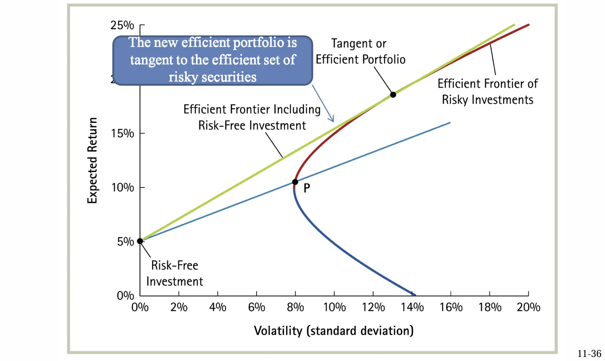
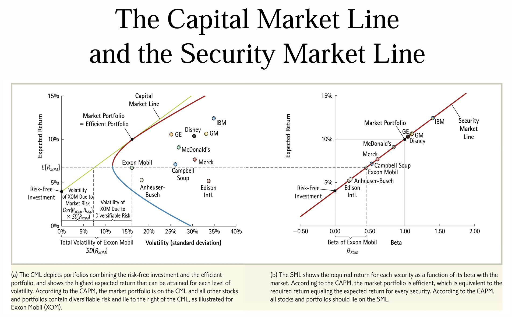
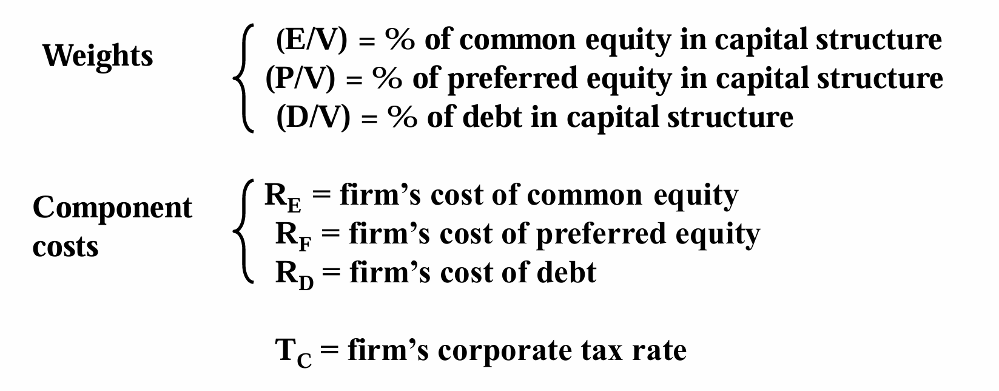
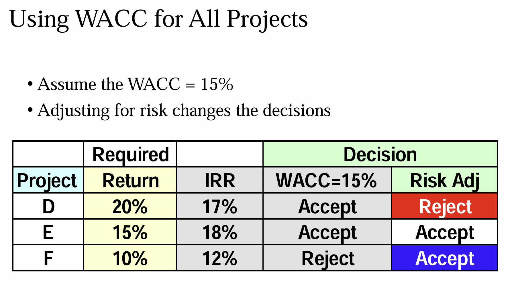
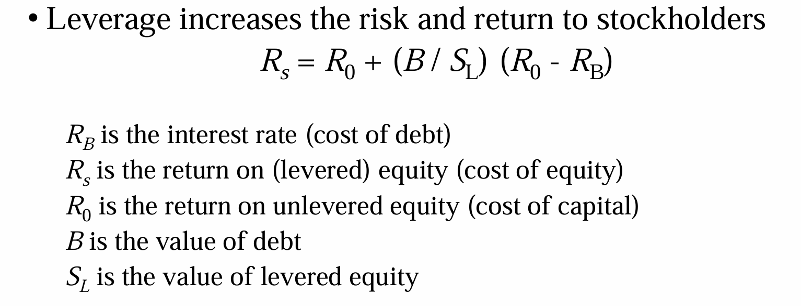
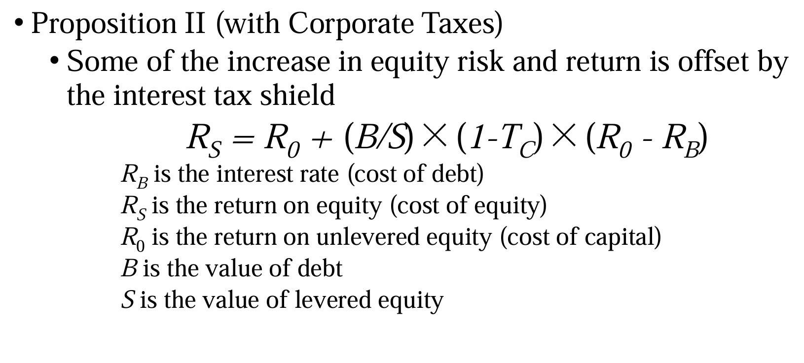

# 融资决策和资产定价

## Risk and Return: Lessons from Market History

- Arithmetic average：简单的每年收益率平均
- Geometric average：最终总收益率然后开次方根

（一个很好的风险对冲的例子，留坑证明：只要不是相关系数为 1，那么就一定可以减小风险）

- Feasible Set：通过投资项目的组合，可以达到的（风险，收益）集合（一般会形成一个向 “收益轴” 凸的曲线）
- Efficient Set：理性投资者会选择的集合（同风险一定会选择收益大的，同收益会选择风险小的）

### Short Sales

> 做空

相当于先借股票，然后在高点抛售，在低点还股票.

如果可以做空，那么可行集的大小会更大（也就是说，我在组合的时候，可以购买负值的股票额）

### Risk-Free Investment

- 引入一个不需要风险的投资（比如短期国债），相当于在 risk = 0 轴上有一个点，这个点可以和风险投资进行组合：

- 比如我选择和风险投资点 P 进行组合，那么组合的点就是一条直线。
- 在 P 点向右，表示贷款投资
- 直线有无数多条，新的可行集是一个扇面——找切线

### Risk Combination

- A systematic risk is any risk that affects a large number of assets, each to a greater or lesser degree. （例如政府政策，加息 / 降息）
- An unsystematic risk is a risk that specifically affects a single asset or small group of assets.（例如单个公司的运营情况）
- 通过资产组合，可以有效降低非系统性风险（系统性风险消不掉，“高系统性风险高回报”）
- 用 $\beta$ 系数衡量系统风险：$\beta = \dfrac{Cov(R_i,R_M)}{Var(R_M)}$​，也就是个股收益率对大盘收益率的敏感性
- 对于大盘来说，它的 $\beta$​ 系数为 1，承担一个单位的系统性风险，大盘的收益率减去无风险收益率就是一个单位风险的风险补偿（风险溢价，因为引入了无风险投资，所以风险 - 收益的有效集是一条直线），**即 CAPM 模型**：

$$
E(r_i)=r_f+\beta_{im}[E(r_m)-r_f]
$$

- 上面这个图，切点就是大盘的收益率和回报率
- 对于各个商品，它和 CML 横向的交点的横坐标就是它的系统风险（收益率不变，通过组合消去非系统性风险）
- 对于一个组合：$\beta_P = \sum_i x_i \beta_i$.

## Risk, Cost of Capital, and Capital Budgeting

> 风险，资本成本和资本预算

- The Market Risk Premium：市场风险溢价，即根据大盘收益率计算出来的这个股票应该有的收益率，低于这个股票实际的收益率，所以很赚
- 估算股票或整个市场的年化预期回报：年化预期回报=股息收益率+股息年增长率
    - 比如我投了 100 块，股息返还了我 2 块，股息增长了 3%
    - 那么就相当于我赚了 2 块以后，我的资产变成了 103 块
    - 这么计算投资者的预期回报率，会有很多问题（比如公司不分红怎么办），所以一般用 $\beta$ 值来计算预期回报率

### Determinants of Beta

#### Business Risk

- Cyclicality of Revenues：一般“周期性”比较强的行业，$\beta$ 值会偏大，因为大盘具有周期性，说明它被大盘的影响较大
- Operating Leverage：经营杠杆，衡量的是固定成本在总成本中所占的比例，并且它描述了销售收入变化对公司盈利的影响（杠杆 = EBIT / sales，对于固定成本高的，我投入了很多，所以后续生产的越多就越省）
- 因此，固定成本越多，约取决于大环境的销量，$\beta$ 值更大

#### Financial Risk

- Financial Leverage：财务杠杆，是指公司通过借入资金（债务）来放大其股东权益回报（即每股收益，EPS）

$$
\beta_{\text{Asset}} = \frac{\text{Debt}}{\text{Debt} + \text{Equity}} \times \beta_{\text{Debt}} + \frac{\text{Equity}}{\text{Debt} + \text{Equity}} \times \beta_{\text{Equity}}
$$

- Debt 的 $\beta$ 值为 0，因为是同一个项目，所以 $\beta_{asset}$ 的值不变，Debt 的比例变高，所以 $\beta_{Equity}$ 不变

**本质上，经营杠杆和财务杠杆是一样的**

### Cost of Debt

- 如果我公司要进行融资，那么融资因为要交利息，所以有成本
- 我所要交的利润，是计算在税前的，所以如果要计算税后的现金流，这个利息是要乘 (1-Tax) 的（相比较下，股东权益是税后的，不用乘系数）

### Cost of Preferred Stock

- 优先股资本成本，相当于分发永续年金
- 相当于投资人买了一个 R = C / PV 回报率的资产
- 相当于公司每年要分发的股东权益为股东的融资乘上 R.

### The Weighted Average Cost of Capital

- **WACC = (E/V) * RE + (P/V) * RF +(D/V) x RD x (1- TC)**

- 公司如何估算单一项目的融资成本：主观估算、找单一出产公司（算 beta）
- 用 WACC 以及风险溢价来做决策（溢价了，就算没到 WACC，也做）

### Flotation Costs 

- 一个项目如果需要融资，发行股票需要成本，发行债券也要成本
- 例如成本是 10%，那么我本来要融 100w，那么我要融 111w

## Long-Term Financing: An Introduction

- 一个完全没有债务的公司是不可能破产的，因为分红不是它的义务，它可以选择把分红拖几年一起付

没啥好说的，纯介绍性质（例如股权、借款的补偿和提前偿还等；债券融资和股权融资的概念）

## Capital Structure: Basic Concepts

- 想要提高风险和收益：做杠杆
- 想要降低风险和收益：一部分钱存银行进行对冲

### MM Theory

#### No Taxes(I)

- 在没有税收的情况下，一个项目、一个公司的价值不会随着它的资本结构改变而改变
- 公司 A 和公司 B 都在进行相同的投资，**所以它们的现金流 $C$​ 是相同的**。根据现金流现值的计算，公司的总价值应该是一样的（价值一样，风险不一样）；
- 从另一个角度来说，公司的杠杆高，风险高，收益高，但是股东完全可以通过财产组合来降低风险，所以价格是一样的

#### No Taxes(II)

**无税收下的公司A的价值：**

假设公司 A 为纯税务公司，产生一个稳定的现金流 $C$，资本成本为 $r_A$，则公司 A 的价值为：

$$
V_A = \frac{C}{r_A},r_A = \frac{C}{V_A}
$$

**公司B的价值：**

对于公司 B，假设公司 B 的资本结构为：债务总额为 $D$，股东权益为 $E$，其总价值为：

$$
V_B = E + D
$$

假设公司 B 的资本成本由债务成本 $r_D$ 和股本成本 $r_E$ 构成，且公司 B 的资本结构比例为债务 $D$ 和股本 $E$ 的比例。由于没有税收，公司的总资本成本可以写作：

$$
r_B = \frac{D}{V_B} r_D + \frac{E}{V_B} r_E
$$

- 两个公司的价值一样，每年的现金流一样，公司规模不扩张的话必然有 $C = V*r$，所以 $r_A = r_B$.

我们有公式：
$$
R_{WACC} = \dfrac{B}{B+S}R_B + \dfrac{S}{B+S}R_S
$$

通过 LHS 为常数可以得到公式：

- 我们可以发现随着公司增加财务杠杆，股东的风险和权益也会升高.

#### With Taxes

- 如果我借钱的话，即债务比变高，那么我的 EBIT 就会变低，收的税就会变少，导致现金流变多
- 省下来的税的现值：$B*r*T/r=B*T$，因此 $V_L = V_U + T_C B$​
- 可以看作银行提供给你了永续年金，不能用 WACC 除因为 WACC 会变

## Capital Structure: Limits to the Use  of Debt

### Bankruptcy risk versus bankruptcy cost

- 影响公司价值的不是破产风险本身，而是破产情况下需要支付的破产成本
- （因为无论经济形势好不好，资本结构不同的公司，自由现金流都是一样的）
- 比如一个项目，要向股权人融资，然后能赚很多钱；但是如果这个公司是有限责任，而且在破产边缘，那么股东可能不愿意做：因为赚来的钱都用来还债了，最后可能甚至不能回本；那还不如直接破产算了

### Trade-off Theory

- 公司的价值回先增高再降低
- 相对应的，公司的价值越高，说明在相等体量下，它的资本成本更低

### Can Costs of Debt Be Reduced?

- 债务成本降低了，现金流变多，公司价值变大
- 在债务签约的时候加一些保护性条款可以降低债务的收取利润（对于放债人来说，加了保护性条款可以降低破产可能性和破产成本）
- 正向条款：必须做；负向条款：不能做
- **Debt Consolidation**：债务合并，如果一个企业是银团贷款，破产的时候会有谈判成本，把多家债务合并成一家可以减少谈判成本（银团贷款的利息因此可能会比一家银行高）

- 公司价值是所有钱减去 Lawyer 和 Government 拿走的钱，前者拿去“破产成本”，后者拿去“税”；
- 改变资产组合，钱的总额不会变，变的是 L 和 G.

### Signaling

- 为什么公司发债以后公司的股价会涨？——1）说明公司有信心可以还债，未来盈利能力强；2）使用债务融资会使代理人问题降低，因为管理者的股权比例没被稀释（稀释以后管理层可能摆烂了）
- Free Cash Theory：公司有闲钱最好分红还给股东，这样可以有效避免管理层挥霍的代理人问题——负债率上升

（所以要缓解代理人问题，导致的结果很可能是负债率上升）

### The Pecking-Order Theory

- 优序融资理论，应该先融资什么？
- 内部融资——外部债务融资——外部股权融资
- 公司在融资过程中，游说需要成本，信息也会不对称
- 对于内部融资，相当于把本来要分红的钱拿来扩大规模，所以相当于变相地提高了公司总资产
- 根据优势融资理论，负债率会先下降再上升再下降，最重要的是融资成本，第二关心的才是负债率

## Valuation and Capital Budgeting for the Levered Firm

> 杠杆企业的估值与资本预算

### Adjusted Present Value Approach

- 就是如果项目加杠杆投资的话，会对净现值有什么变化
- APV = NPV + NPVF
- 其中 NPVF 主要是包括税盾和破产成本，破产成本难以估计，所以一般只考虑税盾
- 所以 APV = NPV + T * B

### Flow to Equity Approach

仅从股东的角度来算，股东做这个项目未来可以拿到的现金流总值

- Step One: Calculate the levered cash flows (LCFs) 
- Step Two: Calculate $R_S$​.
- Step Three: Value the levered cash flows at $R_S$. 

本来计算的话，是用总的现金流除以 WACC，现在是用流向股东的现金流除以股东的回报率，本质上这两个算出来的东西是一样的（即向银行借钱这个行为的现金流是 0）。

### WACC Method

就是混在一起计算，用总的现金流除以 WACC

**这三种方法，都是推 mm 理论的过程公式，所以算出来的总价值都是一样的！**