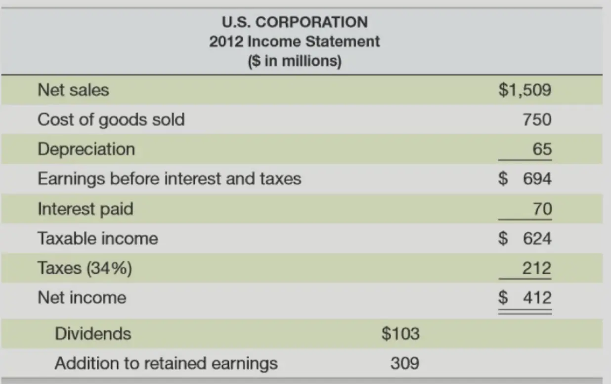
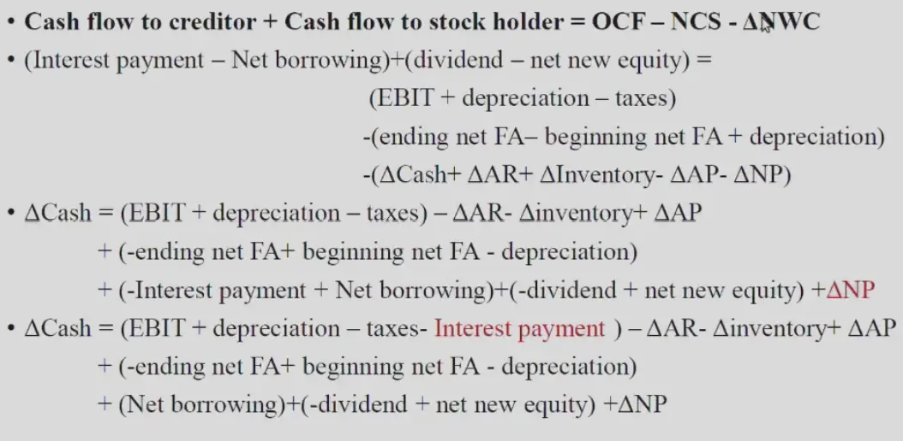

# 财务报表及模型

## Basic Introduction

### The Corporate Firm

#### Sole Proprietorship

- 个人独资企业，由一个自然人投资，财产为个人所有
- 个人对企业承担无限责任
- 在交税的时候，可以绕开公司，只交一次税

#### Partnership

- 合伙企业（普通、有限）
- 普通合伙：都是普通合伙，承担无限责任（General Partnership）
- 有限合伙：有普通合伙，有有限合伙；普通合伙管理权更大（Limited Partnership）
- 经济投资人——有限合伙人：只会亏自己投资的钱

新的股份管理方式：同股不同权（？

#### Cooperation

- 有限公司

### Principle Agent Problem

- 代理人问题（代理人和股东目标不一致）
    - 股票激励计划（Equity Incentive Plan）（限制性股票，对售出年限、公司表现都有要求）
    - Active Investor - 先买股票，参与管理，再卖股票
- 提高公司高管的持股比例（看财产年报，但其实不能只看表面，股权可能会有很多层，不想把信息透露在年报？和管理/税收等相关）

融资/投资决策见 PPT

### The Goal of Financial Management

- 最大化股东权益——最大化股票价值
    - 股票价值和股票价格是有差别的，因为股票价格仅有时长供给需求决定
- 降低成本
- 增大市场占有率

### 股票改善公司治理

- 代理人问题
- Poison Pill Plan：防止大股东恶意收购，即用低价把股票卖给所有小股东，使得股票价格下降（市值会提高）；但是大股东买的是市场均价，是低价、原价均衡后的价格，价格比小股东高。（但本质上是恶意提高公司价值）
- Institutional ownership：机构持股，持股多，能力强

### 公司监督

- 独立董事：不持有公司股份、和公司无利益纠葛，监督公司财务情况、保证公司、中小股东利益。

    法律的惩罚和涉案造成的损失不匹配；独立董事薪资和管理金额不匹配；

- 赔偿股东价格：亏损金额*(1-市场风险系数)

- 监事会：检查财务、董事高管个人行为

- 大股东占款：用上市公司的钱，换自己 100% 掌控公司的钱；“其他应收账款”——挪用资金流，导致没有现金流在公司里。

## Financial Statements and Cash Flow

### The Balance Sheet

“资产负债表”——公司的钱全部属于债务 / 股东权益

#### Assets

- Current Assets: Cash, Accounts receivable, Inventory（库存）
- Fixed assets

#### Liabilities and Owners' Equity

- Current liabilities: Accounts payable（应付账款，购买原材料等）, Notes payable（应付票据，直接借钱）
- Long-term debt
- Owners' Equity: Common stock and paid-in surplus（股东给的钱）, Retained earnings（公司为股东赚的钱）

**两部分的钱相等！** 

**流动性**：固定资产能够变现的能力（book value：账上数字；market value：卖掉公司值多少钱）

### The Income Statement

- Revenue - Expenses = Income

- Interest：利润
- Depreciation：折旧，你在第一年买了一个物品，可以把这个成本均摊到各个年份，具体怎么均摊根据政府规定

### Rates

- 对于累进制税率，平均税率和边际税率不一样
- Average：总税率/总收入；Marginal：根据税率表上的等级就是边际税率

### Financial Cash Flow

- 最后剩下来的现金流（Cash Flow From Assets）：还债、给股东利益
- Operating Cash Flow = Earning before interest and taxes + Depreciation - Taxes
- EBIT = Sale - Cost - Dep
- OCF = Sale - Cost - Tax（折旧不会直接影响 OCF，但是会通过影响税来影响 OCF）

###  Net Capital Spending

- The money spent on fixed assets less money received from the sale of fixed assets（在固定资产上多投入了多少钱，卖掉算负投入）
- NCS = Ending net fixed assets - Beginning net fixed assets + Depreciation

### Changes in Net Working Capital

- 投入用于运营的资本，净营运资本
- The net change in current assets.
- 即流动资产的变化，流动的资产是流动的总资产减去流动的债务
- Change in NWC = Ending NWC - Beginning NWC

$CCFA = OCF -NCS - \Delta NWC$​（Cash Flow From Assets）​

- **OCF 是一年所得的现金流，NWC 是一直存在的用于运营的现金，OCF 是从利润表上算出来的（一年度），NWC 是从财务报表上算出来的（总共）。**

**不用管有没有应收款项和应付款项，如果钱没收回来，那么会被算在短期成本变化中被减掉。**

- 得出的 CCFA 就是还债和分红的钱
- Cash flow to creditor = Interest payment - Net borrowing
- Cash flow to stock holder = dividend - net new equity

一些公式和公司现金流的计算（从最基本的公式推导到公司现金流的计算）

## Financial Statements Analysis and Long-Term Planning

### Categories of Financial Ratios

#### Liquidity Ratios

- Current Ratio（流动比率）= CA / CL
- Quick Ratio （速动比率）= (CA - Inventory) / CL
- Cash Ratio （现金比率）= Cash / CL

#### Financial Leverage Ratios

- Total Debt Ratio（负债比率）= (TA - TE) / TA

    （负债率也就是财务杠杆，用更多的钱干更大的事，但是风险更大）

- Debt/Equity （负债权益比） = TD / TE

- Equity Multiplier （权益乘数）= TA / TE = 1 + D/E

#### Asset Management and Turnover Ratios

##### Inventory Ratios

- Inventory Turnover（库存周转率）= COGS / Inventory（每年卖出商品的成本 / 库存记账成本）
- Days' Sales in Inventory（库存周转天数）= 365 / Inventory Turnover 

##### Reveivables Ratios

- Receivables Turnover = **Credit **Sales / Accounts Receivable（越高说明应收账款转化为现金会更快，注意可能有的 sales 可能直接给现金！不算 credit！）
- Days' Sales in Receivables 

##### Asset Turnover Ratios

- Total Asset Turnover = Sales / Total Assets（单位总资产可以产出多少销量）

#### Profitability Measures

- Profit Margin = NI (Net Income) / Sales
- Return on Assets (ROA，资产收益率，对于公司来讲) = NI / TA
- Return on Equity (ROE，权益收益率，对于股东来讲) = NI / TE
- EBITDA Margin（息税、折扣及摊销前利润率） = EBITDA / Sales

#### Market Value Measures

- PPS : Price Per Share
- Shares outstanding : 股票总数
- EPS : Earning Per Share
- PE Ratio（市盈率） = PPS / EPS，市盈率大的公司，说明股市比较看好，未来可以有更大盈利
- Market-to-book ratio = PPS / Book value per share
    - Book value per share = Total Equity
    - 市净率一般会大于 1，市场价值一般会大于账面价值

### The Dupont Identity

### Financial Models

- Dividend payout ratio（股利支付率）= Dividends / NI
- retention ratio（留存收益率）= 1 - d

**当我们想扩大公司规模时（增长公司假设负债表左边所有都等比例增大）：**（例如买入设备会增加 NCS，花的不是 CCFA）

#### External Financing Needed(EFN)

- 分析资产负债表，看看左右差了多少，即为外部融资需求量，表示公司规模增长以后需要的融资
- $EFA=TA\cdot g-sponliab \cdot g-NI(1+g)(1-d)$
- spon liab：负债自然增长率，可视为 0.
- 其实就是在 retained earning 等比例增长以后，先等比例分红，然后投入公司增长，还缺的钱那就是要多借的债务。

#### The Internal Growth Rate

- 内部增长率，在没有外部融资的情况下可能实现最大增长率
- TA * g = NI * (1+g) * b
- g = ROA * b/(1-ROA * b)

#### The Sustainable Growth Rate

- 在没有外部股权融资且负债率不变的情况下最高增长率
- TA * g - NI * (1+g) * b = (TA - TE) * g
- g = ROE * b/(1-ROA * b)