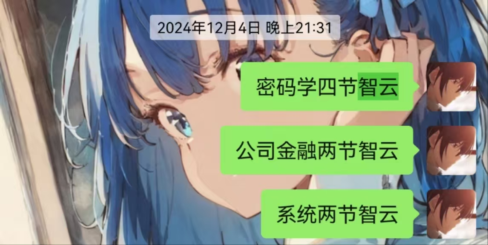
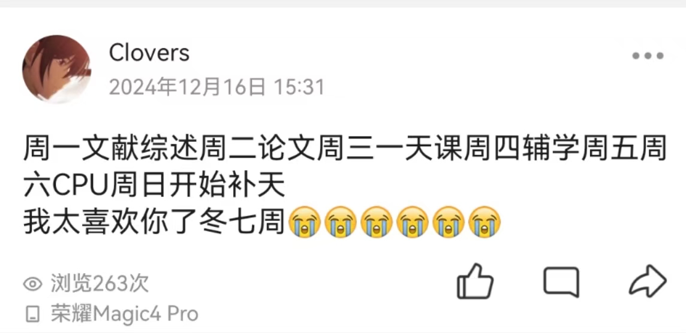

# 大二上学期总结

> 现在是 2025 年 1 月 26 日，距离全部课程出分完毕也已经一周多的时间了。放假后接踵而至的社会实践、一切尘埃落定以后报复性的补觉打游戏、下定决心买了 mac 然后爽配三天环境……不知不觉马上除夕了。
>
> 想起了每次期末周都无比期待假期的自己、立下豪言壮语的自己，哈哈……
> 
> 无论如何，在这个无所事事的下午，给大二上的课程、学生工作、竞赛经历写一个总结，也算是给过去一个学期画上一个比较圆满的句号吧。
>
> 现在是 2025 年 2 月 7 日，距离开学只有一周的时间了。因为上次写完引言被拉去喝酒了，所以一直拖拖拖拖到现在。至于为什么今天写？因为来图书馆发现忘记带 Apple pencil 了……

## 课程总结

大部分课程的平时压力不算大，在有竞赛任务的情况下还是能应付得过来的（虽然后面补智云火葬场）。

但是总共 10 门课程有 8 门期末考，基本都是硬课，冬学期的最后两周简直和噩梦一样，我想这已经是我的极限，我也不想再体验第二次这样的期末周了。

从最终结果来说，我只能说感谢自己的未雨绸缪，acm 结束就立刻开始补智云的大业、冬七周下定决心赶完 ddl，为冬八周的提前复（yu）习提供了时间。事实证明只靠考试周那一两天的补天，无论是从积淀还是熟练度来讲都是远远不够的。

### 专业课程

> 《高级数据结构与算法分析》《计算机系统II》《人工智能引论》《数据安全与密码学基础》

ADS 因为比较有基础，基本没怎么多花时间。我认为算法分析的部分才是这个课的精华部分，但是由于课程难度要求以及个人时间有限，我更多的只是简单记结论，将来有时间（显然不可能）或许可以补充一下。

系统 II 在最开始我还延续着系统 I 的学习习惯——不学（fb 害人不浅）。但是马上就在操作系统的课上火葬场了，每次小测 / 提问都不会真的很难受！于是对着 wp 的博客整了个[笔记](../../cs/system/os/index.md)，但是是期末才整的，下个学期希望能及时整理吧。

补写一下系统实验的感想吧（因为之前写 lab7 report 的时候一直拖拖拖结果到 ddl 来不及了就没写感想）。系统统一软硬件的课程思想是浪漫而又困难的，课程的广度注定着这个课有着较高的自学瓶颈，系统 I 到系统 III 使用同一个实验框架又对学生的学习连续性有着极大的要求。

课程的年轻一方面给我们带来了先进的教学体系和实验框架，但是另一方面给我们带来的是缺少经验。很多同学面对不是很成体系（这没法避免）的实验文档、较为稀缺的参考资源、非常难调试的 CPU、这次不出现下次又突然冒出来的 bug，大多会感到迷茫、又或流向我们最不想看到的场景——依靠他人。而依靠是一种习惯，只有 0 次和无数次。

我并不是否定系统这个课程，我非常认同这个统一的教学思想，这已经比传统的 cs 四件套好很多了，但如何能让一个课程兼顾能力强的学生和比较有困难的学生，并且让学生真正感受系统各个元素交互的魅力，我想这不仅是这个课，更是整个 cs 教育体系需要思考的。

aid 没啥好说的，我认为要么削减学分，开成一个纯正的通识课，要么降低课程目标，以实验作为课程的主要评价标准，现在眼高手低的开课模式不如直接删了。

密码学算是课改里面比较成功的了，抛弃了以往重工程的教学方式，从可证明安全的角度讲了为什么要构建这个密码、这个密码是如何安全的，很戳我的 xp（错乱）。总的来说跟上智云就能拿到很好的分数了，张聪老师也很愿意给高分。

### 数理基础课程

> 《概率论（H）》《普通物理学II（H）》《普物实验II》

概率论很难啊！又或者说本来就应该这么难。把一个重要的课程安排在工作量这么大的学期，招来的是学生天然的不重视，最后的结果也是可想而知。

普物，哈哈……物理很有意思，但是考试就没意思了。

普物实验本身没什么开的必要，但是我认为大实验还是很不错的，相当于搞了个小科研。我的任务是复现点源法还有 GS 算法，虽然最后还是没实现从频率图还原全息图（感觉是理论部分哪里学假了），但是因为 PPT 做（糊弄）得还不错，所以给分还行。

### 通识课

> 《先秦诸子思想》《篮球》

我脑抽了选个哲学通核。

### 金融学课程

> 《公司金融》

大一下的时候脑袋一热报了金融学的辅修，但现在我觉得应该认真评估一下辅修的成本和收益。

或许将来我会从事相关的行业，但是从学校的经济 / 金融学的课程质量以及备考一门课程的边际效益，我觉得我不应该为了一个证书去耗费这么多的时间。

至少，我目前还有我认为更有意义的事情要做。

当然，我对这个领域仍有浓厚的兴趣，课余时间或许会挑选一些优质的智云或者书籍学习吧。

说回《公司金融》这个课程，我其实无比感激自己在众多金融学中挑选了《公司金融》的这个课。这个课不仅仅是对金融学、会计学繁杂知识内容的一个浓缩，也有很多现实生活中公司投资、融资的例子。正如学了微经一样，学了公司金融以后我有了最基本的金融素养，也能用相对专业的眼光来看一些事务。

洪鑫老师的讲课也很好，给分也不错，考完试还发红包，但是我没抢到呜呜呜（微信群免打扰选手）。

## 学生工作

我一直幻想着有一个疯狂的青春。

军事化管理的高中剥夺了我许多，前一年半面对的是滚烫的屏幕，后一年半面对的是冰冷的试卷。

不行太肉麻了写不下去了……

总之就是组织部非常好！我真的很庆幸留在了团委组织部，见到了这么多玩得来的同学，做了很多之前想都不敢想的事情！

同时，工作的时候也越来越发现自己不会说话……还是希望自己能再“圆滑”一点，能放得下面子一点。

## 竞赛经历

真失败啊。

已经在其他人面前说了无数次主观的、外界的原因，但真正客观的原因是实力不够，也不够努力。这样的成绩或许确实配不上我的实力，但归根结底还是实力不够。

我还是没有下定决心要去改变什么，去学一些没学过的知识点、写一些不熟练的代码，我只是一味地相信，相信下一次的自己一定可以。两次倒在了最后五分钟，倒在了一念之间，现在已经没有下一次了。

高一省选的意气风发，却已经是我的巅峰。清北夏令营的两次失败、NOI 的耻辱铜牌、NOIP 后 3 小时一分未得，这些记忆如梦魇一般缠绕着我的 OI 生涯，如今的 acm 经历似乎就是这一切的延伸。

无所谓了，现在终于结束了。

时隔两年，我用一个学期的失败给高中最疯狂的两年画上了句号，虽然这个句号是不完美的，但毕竟结束了，我也接受了。

竞赛生涯无形之中改变了我很多，正如当时退役的时候发的说说“开心过，痛苦过，或许没有成功过，但是确实成长过”，它让我成为了现在的我，而我也始终相信一切都是最好的安排。

再给我一次机会，我会不会选择信息竞赛？

不好意思，不会。